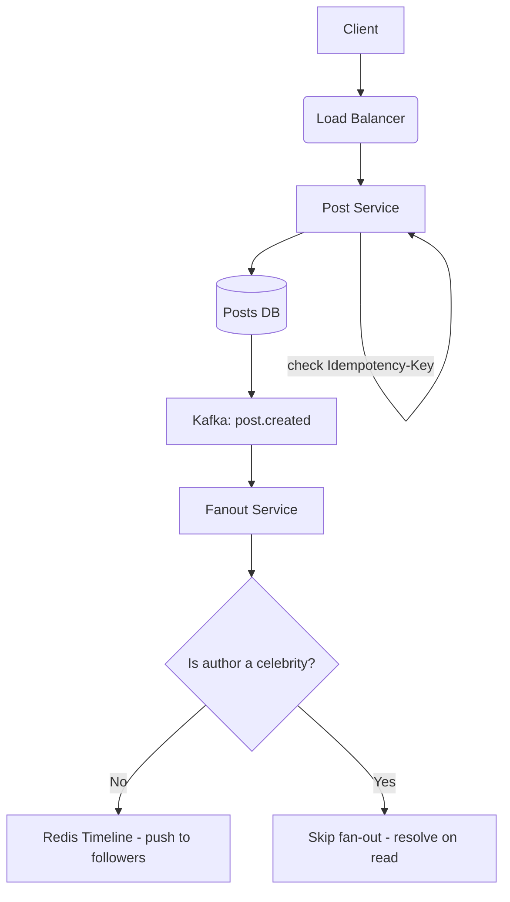
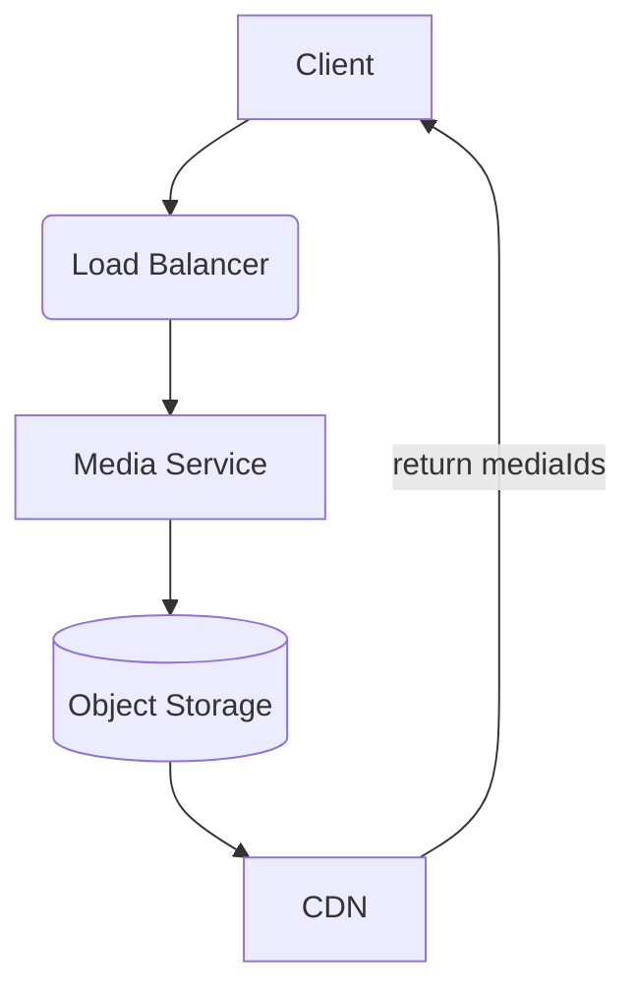
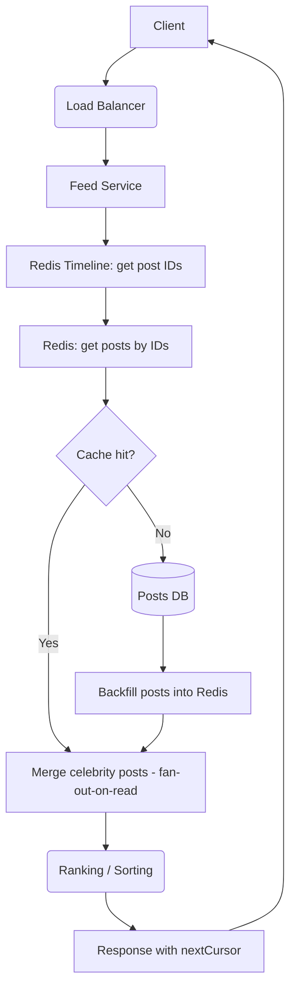
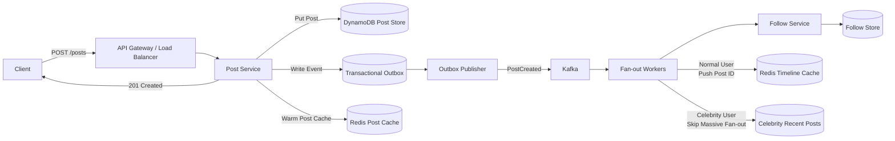
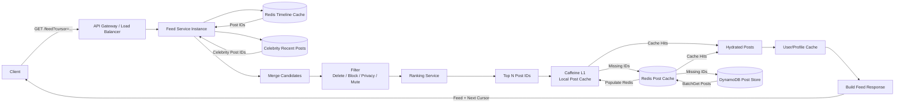

# Frameworks:
1. Requirements
   - Functional requirements
   - Non-functional requirements
2. Scale
   - How many posts per day?
   - How many times does a user open new feeds per day?
   - DAU / QPS
   - Write / Read ratio
3. Design Api
4. Design Model + DB schema
5. High-level architecture
6. Core components
7. Final architecture
8. Trade-offs

## 1. Requirements
### Function requirements
- User can create a new post (text, image, video)
- User can follow/unfollow other users
- Followers can see following users' posts on the news feed
- Users can see their own posts on their profile page
- News feed is a list of posts from the following users ordered by time/ ranking

### Non-functional requirements

#### **Low latency**

News feed should be loaded quickly (<1s):

- **Bad practice**:
    - Open news feed -> query posts of followers -> merge posts -> sort posts.
    - One user can follow 1000 users, resulting in 1000 queries to fetch all posts.
- **Solutions**:
    - Fetch posts in bulk using a single query.
    - Store posts in a distributed cache and pre-sort them by ranking or time.
    - Use background workers to periodically refresh cached feeds for active users.

#### **High availability**

News feed should be available even if a user is offline:

- **Solutions**:
    - Store posts in a distributed cache to allow users to see posts even if the server is down.
    - If ranked posts are not available, fallback to chronological sorting of posts.

#### **Eventual consistency**

If user A posts a new post, user B can see it after a while (no strong consistency required):

- **Trade-off**: Balances consistency and performance by using tools like Kafka and Fanout Service.
- **Solutions**:
    - Introduce delay-tolerant queues to manage post-propagation.

#### **Durability**

If a post is successfully created, it cannot be lost:

- **Solutions**:
    - Implement write-ahead logging.

#### **Scalability**

Feeds pagination should use cursor-based pagination rather than offset-based pagination:

- **Solutions**:
    - Partition cached feeds based on user activity levels for optimized load distribution during scaling.

## 2. Scale
- **DAU**: 100M
- **New posts per day**: 50M
- **New feeds per day for one user**: 10 requests/day
- **Average followings per user**: 500
- **Post write QPS**:
    - 50M / 86,400 = ~580 writes/s
    - Peak x5 = ~3,000 writes/s
- **Post-read QPS**:
    - 100M * 10 = 1B / 86,400 = ~12,000 reads/s
    - Peak x5 = ~60,000 reads/s
- **Write/Read ratio**:
    - 3,000 : 60,000 = 1 : 20
    - Read-heavy application -> use cache to reduce read latency.
- **Fan-out cost**:
    - 50M * 500 = 25B / 86,400 = ~289k feeds/s
    - Peak x5 = ~1.445M feeds/s
    - 580 writes/s : 289,000 feeds/s = 1 : 48
  - **Solution**: Use distributed Redis clusters to handle the high volume of writes and implement fan-out-on-write.
- **Celebrity problems**:
    - Example: Taylor Swift with 100M followers -> 1 post = 100M Redis writes -> very high cost
    - **Solution**: For celebrity posts, use a hybrid approach: precompute feeds for a subset of followers while relying on fan-out-on-read for the rest.
- **Media problems**:
    - 1 post has media = 10KB -> 50M * 10KB = 500MB
    - **Solution**: Use a CDN to serve media files and do not store them in DB
### Cache strategy:
| Data      | Read        | Write                           |
|-----------|-------------|---------------------------------|
| Post      | Cache aside | DB -> populate/invalidate cache |
| Profile   | Cache aside | DB -> invalidate                |
| News feed | Redis       | Kafka fanout                    |
| Follower  | DB          | DB                              |
| Media     | CDN         | Object storage -> CDN           |

## 3. Design Api
### CREATE POST
- Method: POST
- URL: /posts
- Headers:
    - Authorization: Bearer <token>
    - Content-Type: application/json
    - Idempotency-Key: <uuid>
- Body:
    ```json
    {
        "text": "Learning system design!",
        "mediaIds": ["1", "2", "3"]
    }
    ```
- Response: 201 CREATED

### NEWS FEED
- Method: GET
- URL: /feed?limit=20&cursor=1234567890
- Headers:
    - Authorization: Bearer <token>
- Response:
    ```json
    {
          "items": [
                      {
                          "postId": "984728374982374",
                              "author": {},
                          "text": "Learning system design!",
                              "createdAt": "..."
                      }
            ],
          "nextCursor": "eyJ..."
      }
  ```
### PROFILE
- Method: GET
- URL: /users/{userId}/posts?limit=20&cursor=1234567890
- Headers:
    - Authorization: Bearer <token>
- Response:
    ```json
    {
          "items": [
                      {
                          "postId": "984728374982374",
                              "author": {},
                          "text": "Learning system design!",
                              "createdAt": "..."
                      }
            ],
          "nextCursor": "eyJ..."
      }
  ```
### FOLLOW
- Method: POST
- URL: /users/{userId}/follow
- Headers:
    - Authorization: Bearer <token>
- Response:
    ```json
    {
          "followingId": "456"
  }
  ```
### UNFOLLOW
- Method: DELETE
- URL: /users/{userId}/follow
- Headers:
    - Authorization: Bearer <token>
- Response:
    ```json
    {
          "followingId": "456"
  }
  ```

## 4. Design Model + DB Schema

### USER

- **Table:** `users`
- **Columns:**
    - `id` (string - primary key)
    - `username` (string - unique)
    - `displayName` (string)
    - `createdAt` (datetime)
- **DB Type:** Postgres
- **Scaling Strategy:** Sharding by `id`

### POST

- **Table:** `posts`
- **Columns:**
    - `id` (string - primary key)
    - `authorId` (string - foreign key to `users.id`)
    - `text` (string)
    - `mediaIds` (string[])
    - `createdAt` (datetime)
    - `deletedAt` (datetime - nullable)
- **DB Type:** Postgres
- **Scaling Strategy:** Sharding by `id`

#### Considerations for Fetching Posts by authorId

- Use a **secondary index** to retrieve all posts of an author efficiently.
- **Table:** `postsByAuthors`
    - **Columns:**
        - `authorId` (string - partition key)
        - `bucket` (string - for sharded partitions)
        - `postId` (string)

### FOLLOWER

- **Table:** `followers`
- **Columns:**
    - `userId` (string - primary key)
    - `followerId` (string - composite key)
    - `createdAt` (datetime)
- **DB Type:** Postgres

### USER FEED

- **Table:** `userFeeds`
- **Columns:**
    - `userId` (string - primary key)
    - `postId` (string)
    - `score` (float - for ranking posts)
- **DB Type:** Redis
- **Alternative Solution:** DynamoDB

#### Comparison: Postgres vs. DynamoDB

| Aspect            | PostgreSQL                                   | DynamoDB            |
|-------------------|----------------------------------------------|---------------------|
| **Scale**         | Manual sharding                              | Auto-scaling        |
| **Peak QPS**      | 3,000 writes / 60,000 reads (bottleneck)     | High throughput     |
| **Hybrid Fanout** | JOIN Follow + Post of Celebrity (bottleneck) | Query by SK < 100ms |

#### DynamoDB Schema Design

- **Table: `posts`**
    - **Primary Key:** `POST#{postId}`
    - **Columns:**
        - `authorId` (string)
        - `text` (string)
        - `mediaIds` (string[])
        - `createdAt` (datetime)
        - `deletedAt` (datetime - nullable)
    - **Global Secondary Index (GSI):**
        - GSI1PK = `AUTHOR#{authorId}#{month:yyyy-MM}`
        - GSI1SK = `{createdAt}#{postId}`

- **Table: `users`**
    - **Primary Key:** `USER#{userId}`
    - **Columns:**
        - `username` (string)
        - `displayName` (string)
        - `createdAt` (datetime)

- **Table: `followers`**
    - **Primary Key:** `USER#{userId}`
    - **Sort Key:** `FOLLOWER#{followerId}`
    - **Columns:**
        - `createdAt` (datetime)
    - **GSI (for reverse lookup):**
        - GSI1PK = `FOLLOWER#{followerId}`
        - GSI1SK = `USER#{userId}`

**Table: `outboxes`**
  - **Primary Key:** `EVENT#{eventId}`
  - **Columns:**
      - `eventType` (string)
      - `aggregateId` (string)
      - `payload` (string)
      - `status` (string)
      - `createdAt` (datetime)
      - `publishedAt` (datetime)
      - `retryCount` (number)
      - `expiresAt` (number)
    
**Table:** `userFeeds`
  - **Columns:**
      - `userId` (string - primary key)
      - `postId` (string)
      - `score` (float - for ranking posts)
  - **DB Type:** Redis

## 5. High-level architecture
### CREATE POST-FLOW

### MEDIA UPLOAD FLOW

### FEED READ FLOW


## 6. Core components

### 6.1. Fanout on Read

- **Description:** Fanout on read allows a service to distribute a request to multiple downstream services. This is
  useful when multiple downstream services are needed to process a request.

#### Example: Normal User

- **Scenario:**
    - User A follows 1000 users and requests the news feed.
    - The Fanout Service queries 1000 downstream services to fetch their respective news feeds.
    - Results are merged to generate the final feed for User A.
- **Evaluation:** This **does not scale well** for larger user numbers and is a **BAD PRACTICE**.

#### Example: Celebrity User

- **Scenario:**
    - User A follows 100 celebrities and requests the news feed.
    - The Fanout Service queries 100 downstream services to fetch the feeds of these celebrities.
    - Results are merged and returned to the user.
- **Evaluation:** This approach is **scalable and efficient** for large follow counts, making it a **GOOD PRACTICE**.

### 6.2. Fanout on Write

- **Description:** Fanout on write involves distributing a request to multiple downstream services at the time of data
  creation, such as creating a post.

#### Example: Normal User

- **Scenario:**
    - User A (with 1000 followers) creates a new post.
    - The Fanout Service notifies 1000 downstream services to update their respective feeds.
    - Followers see the updated news feed in real-time.
- **Evaluation:** This approach is **efficient** for updating feeds without querying them repeatedly, thus a **GOOD
  PRACTICE**.

#### Example: Celebrity User

- **Scenario:**
    - Celebrity A creates a new post.
    - The Fanout Service sends notifications to 1M downstream services to update their feeds.
- **Evaluation:** This approach is **not scalable** when dealing with a massive number of followers, making it a **BAD
  PRACTICE**.

### 6.3. Hybrid Fanout

- **Description:** Combines fanout on read and fanout on write for optimized results.

|                 | Normal User | Celebrity |
|-----------------|-------------|-----------|
| Fanout on Read  | BAD         | GOOD      |
| Fanout on Write | GOOD        | BAD       |

#### Example:

- **Scenario:**
    - User A follows Taylor Swift (celebrity) and 500 normal users.
    - User A requests a news feed of 20 posts.
    - Hybrid Fanout:
        - Use Redis to return pre-computed posts from normal users (via fanout on write).
        - Query for Taylor Swift’s recent posts (via fanout on read).
    - Merge and return the results.

### 6.4. Kafka / Event Streaming

- **Use Case:** Ensures eventual consistency by using Kafka to distribute events to downstream services.

#### Problem 1: Post insertion in DB succeeds, but publishing to Kafka fails; or Kafka succeeds, but DB rollback occurs.

- **Solution:** Implement the **Outbox Pattern** to safely store events in the DB for eventual publication.

#### Problem 2: Consumer crashes while processing a post update for 1M followers.

- **Solution:** Partition followers and assign them to workers to handle failures efficiently.

#### Problem 3: practical design of Kafka is at-least-one
- **Solution:** Idempotency Key -> use idempotency key to check if post already exists in DB

### 6.5. Timeline Cache

- **Use Case:** Caches the most recent posts to improve performance.
- **Description:** A Redis-based cache storing recent posts/scores in a sorted set.
- **Key:** `timeline:{userId}`
- **Value:** `postId, timestamp/score`
- **TTL:** 7 days

#### Bounded Timeline Cache

- Limit stored timeline cache to the last 7 days or the most recent 100 posts.
- **Solution:** After pushing a post to the timeline cache, remove the oldest post if the cache is over the limit.

#### Post Retrieval Process

- Feed Service -> Timeline Cache -> Fetch 20 post IDs -> POST CACHE MGET -> Resolve 18 cached & 2 missed -> Query DB for
  missed -> Return to Client

### 6.6 Ranking Service

- Formula: `score = w1 * recency + w2 * relationship_strength + w3 * engagement_probability + w4 * content_relevance`

#### Ranking Feed with Cursor

- **Consideration:** Ranking score may change between requests.
- **Solution:** Use an encoded cursor including `ranking score, post id, timestamp, sessionId`.

### 6.7 Follow/Unfollow Complications

#### A follows B

- **No backfill:** Only new posts by B are added to A's timeline cache.
- **With backfill:** All posts by B are added, increasing fanout write traffic.

#### A unfollows B but B's posts exist in A's timeline cache

- **Solution 1:** Asynchronously remove B's posts from A's timeline cache.
- **Solution 2:** Validate feeds on request to filter out unfollowed/blocked/deleted posts.

### 6.8 Redis Failure

- **Problem:** If Redis is unavailable, the timeline cache is empty.
- **Solution:** Rebuild the timeline cache from the database or fallback to fanout-on-read.

### 6.9 Read-Your-Own-Write

- **Followers:** Eventual consistency is acceptable.
- **Author:** Ensure read-your-own-write consistency.

# 7. Final architecture
## CREATE FLOW

### Feed Request Flow

